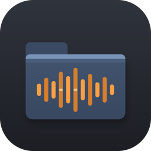

# FLIndexRenders

**Find every render FL Studio ever exported — grouped by the project it came from, with the samples that went into it.**

Renders (your bounced/exported tracks) are needles in a haystack. They're the same
file types as the thousands of samples on your drive, and file dates lie — plenty of
sample packs ship with modified dates set years in the future, so "sort by newest"
is useless. Searching *"everything"* for your own tracks means scrolling past a sea
of one‑shots and loops.

FLIndexRenders indexes your FL Studio projects and the audio around them, figures out
which audio files are **renders of which project**, and trees them so you can find a
track in seconds — then shows you the exact samples you used to make it.

<p align="center"></p>

Developed by **ajh** — [ajh.wtf](https://ajh.wtf) · sister tool to
[FLSearchBySample](https://github.com/1ajh/FLSearchBySample)

---

## Download & run

### Windows
1. Download **`FLIndexRenders.exe`** from the [Releases](https://github.com/1ajh/FLIndexRenders/releases) page.
2. Double‑click it. That's it — no installer, no Python needed.

> First launch may show a Windows SmartScreen prompt because the app isn't code‑signed
> (a certificate costs money). Click **More info → Run anyway**. It's a single
> self‑contained executable.

### macOS
A `.app` can only be compiled on a Mac, so you have two options:

- **Build a real app (recommended):** with Python 3 installed, open Terminal in this
  folder and run `./build_mac.sh`. It produces `dist/FLIndexRenders.app` — drag it into
  Applications. First launch: right‑click the app → **Open** (unsigned build).
- **No build:** double‑click **`FLIndexRenders.command`** to run it straight from source
  using your system Python 3.

### Any OS, from source
```
python app.py        # Python 3.9+, standard library only — nothing to install
```

## What it does

- **Trees every render under its project.** The main view is a collapsible tree:
  each project with the renders that belong to it, showing format, length, date and
  location. A `▶ Play render` opens it in your default player; **Open in FL Studio**
  opens the project.
- **Shows the samples that went into a render.** Select any project or render and the
  detail pane lists *every* sample the project uses (including ones buried in plugins
  like FPC/DirectWave/Slicex). Missing samples are flagged in red.
- **Finds renders hiding in your sample folders.** Point it at your export/sample
  folders and it surfaces the renders among them — without you scrolling past
  thousands of samples.
- **Groups format variants.** `mybeat.wav` + `mybeat.mp3` + `mybeat_24bit.wav` count
  as **one** render, so the counts mean something.
- **"Renders with no matching project"** — a separate bucket for exports whose project
  you've lost or renamed. Right‑click one to **link it to a project** by hand, or hide
  it if it isn't a render.
- **Search** across project names, render file names *and* sample names. `kick sparta`
  finds projects that used both.
- **Export sample list** — write a project's renders + full sample list to a `.txt`.
- **Themes** — FL Dark, Midnight, Graphite, Light, High Contrast (View → Theme),
  remembered between launches.

The first scan reads your projects and probes the plausible renders around them, then
caches everything — later launches are instant and only re‑read files that changed.

Cache location:
- Windows: `%LOCALAPPDATA%\FLIndexRenders\index.json`
- macOS: `~/Library/Application Support/FLIndexRenders/index.json`
- Linux: `~/.local/share/FLIndexRenders/index.json`

## How the matching works

There is **no reliable "made by FL Studio" stamp** inside an audio file, so
FLIndexRenders matches on structure and scores each guess:

| Signal | Why it's used |
|--------|---------------|
| **Render name = project name** | FL's Export dialog pre‑fills the filename with the project name — the strongest signal. Names are normalised (case/Unicode, and decorations like `master`, `140bpm`, `Fmin`, `v2`, dates are stripped for a secondary match). |
| **Folder named after the project** | FL exports stems into a folder named after the project, so `.../My Beat/Kick.wav` is attributed to *My Beat*. |
| **A project's input samples are excluded** | A file a project *uses as a sample* can't be that project's *render* — checked per project, so a render you re‑imported into a different project still matches its own. |
| **Location / length / tempo chunk** | Sitting next to the `.flp` or in a `Rendered/Exports/Bounces` folder, being minutes long, or carrying an FL `acid` tempo chunk all raise confidence — but never create a match on their own. |

Matches are labelled **high / medium / low** confidence. Renders with no project land
in the orphan bucket **only** when there's positive evidence (a render‑named folder,
FL tempo metadata, or — if you opt in via *"List long unmatched audio as possible
renders"* — any long unmatched file). This keeps your ordinary samples out of the way.

Honest limitations: a render you renamed to something completely unrelated to the
project, with no revealing metadata, can't be linked automatically — that's what the
**Link to project…** right‑click action is for.

## File map

| File | Role |
|------|------|
| `flp_parser.py` | FLP binary parser — extracts a project's samples, title, version (no deps) |
| `audio_meta.py` | Pure‑stdlib duration/metadata probe for WAV/AIFF/FLAC/Ogg/MP3 |
| `render_matcher.py` | The render↔project matching logic (deterministic, unit‑tested) |
| `indexer.py` | Cached index of projects + renders, incremental rescan, search |
| `platform_utils.py` | Cross‑platform paths, open/reveal, FL macro resolution |
| `app.py` | Tkinter GUI |
| `assets/make_icon.py` | Regenerates the app icon |

`flp_parser.py` handles a real‑world quirk: **FL Studio 25.2.4+ writes header event
172 with a 3‑byte payload**, breaking the classic TLV size rule and desyncing naive
parsers. It's version‑gated here.

## Build

```
pip install pyinstaller pillow
./build_windows.ps1     # Windows -> dist\FLIndexRenders.exe
./build_mac.sh          # macOS   -> dist/FLIndexRenders.app
```

## Tests

```
python -m unittest discover -s tests
```

No third‑party packages required — the suite synthesizes tiny `.flp` and audio
fixtures and runs on the standard library alone.

## License

MIT — see [LICENSE](LICENSE). Not affiliated with or endorsed by Image‑Line;
FL Studio is a trademark of Image‑Line.
